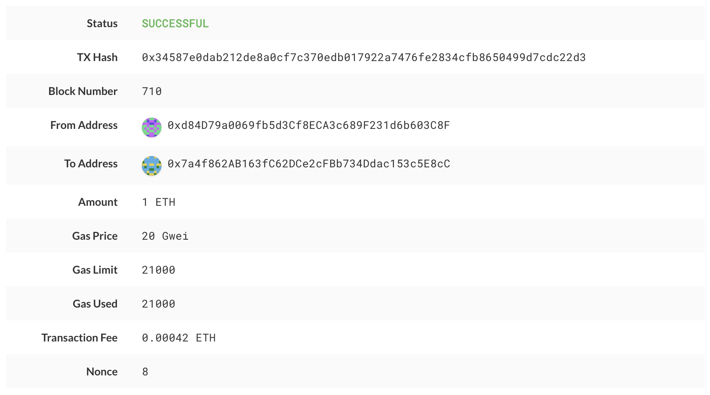

# Proof of Authority Development Chain

In this assignment, I took on the role of a new developer at a small bank and set up a testnet blockchain for the organization.

To do this, I created four deliverables:

* Set up a custom testnet blockchain.

* Sent a test transaction.

* Created a repository.

* Wrote instructions on how to use the chain for the rest of your team.

## Background

I landed a new job at ZBank, a small, innovative bank that is interested in exploring what
blockchain technology can do for them and their customers.

My first project at the company is to set up a private testnet that my team of developers
and I can use to explore potentials for blockchain at ZBank.

I decided on setting up a testnet because:

There is no real money involved, which will give my team of developers the freedom to experiment.

Testnets allows for offline development.

In order to set up a testnet, I needed to use the following skills/tools we learned in class:

* Puppeth, to generate your genesis block.

* Geth, a command-line tool, to create keys, initialize nodes, and connect the nodes together.

* The Clique Proof of Authority algorithm.

Tokens inherently have no value here, so I provided pre-configured accounts and nodes for easy setup.

After creating the custom development chain, I created documentation (see the screenshots folder) for others on how to start it using the pre-configured nodes and accounts. 

## Instructions

### Setup the custom out-of-the-box blockchain

* Created a new project directory for my new network. 

* Created a "Screenshots" folder inside of the project directory.

* Created accounts for two (or more) nodes for the network with a separate `datadir` for each using `geth`.

* Ran `puppeth`, name your network, and select the option to configure a new genesis block.

* Choose the `Clique (Proof of Authority)` consensus algorithm.

* Pasted both account addresses from the first step one at a time into the list of accounts to seal.

* Pasted them again in the list of accounts to pre-fund. There are no block rewards in PoA, so you'll need to pre-fund.

* You can choose `no` for pre-funding the pre-compiled accounts (0x1 .. 0xff) with wei. This keeps the genesis cleaner.

* Completed the rest of the prompts, and when you are back at the main menu, choose the "Manage existing genesis" option.

* Exported genesis configurations. This will fail to create two of the files, but you only need `networkname.json`.

* Deleted the `networkname-harmony.json` file.

* Screenshot the `puppeth` configuration once complete and save it to the Screenshots folder.

* Initialized each node with the new `networkname.json` with `geth`.

* Ran the first node, unlock the account, enabled mining, and the RPC flag. Only one node needs RPC enabled.

* Set a different peer port for the second node and used the first node's `enode` address as the `bootnode` flag.

* Unlocked the account and enabled mining on the second node!

* I was able to see both nodes producing new blocks!

### Send a test transaction

* Used the MyCrypto GUI wallet to connect to the node with the exposed RPC port.

* Used a custom network, and included the chain ID, and used ETH as the currency.

* Imported the keystore file from the `node1/keystore` directory into MyCrypto. This will import the private key.

* Sent a transaction from the `node1` account to the `node2` account.

* Copied the transaction hash and pasted it into the "TX Status" section of the app, or click "TX Status" in the popup.

* Screenshot the transaction metadata (status, tx hash, block number, etc) and saved it to your Screenshots folder.

### Create a repository, and instructions for launching the chain

* Created a `README.md` in your project directory and create documentation that explains how to start the network.

* Remembered to include any environment setup instructions and dependencies.

* Included all of the `geth` flags required to get both nodes to mine and explain what they mean.

* Explained the configuration of the network, such as it's blocktime, chain ID, account passwords, ports, etc.

* Explained how to connect MyCrypto to your network and demonstrate (via screenshots and steps) and send a transaction.

* Uploaded the code, including the `networkname.json` and node folders.

---
© 2021 Trilogy Education Services, a 2U, Inc. brand. All Rights Reserved.
ite. 